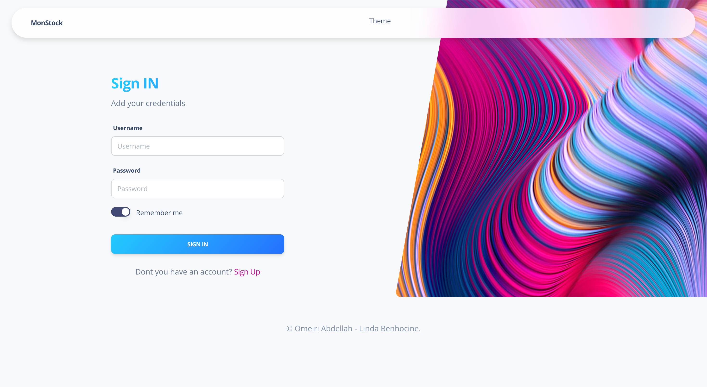
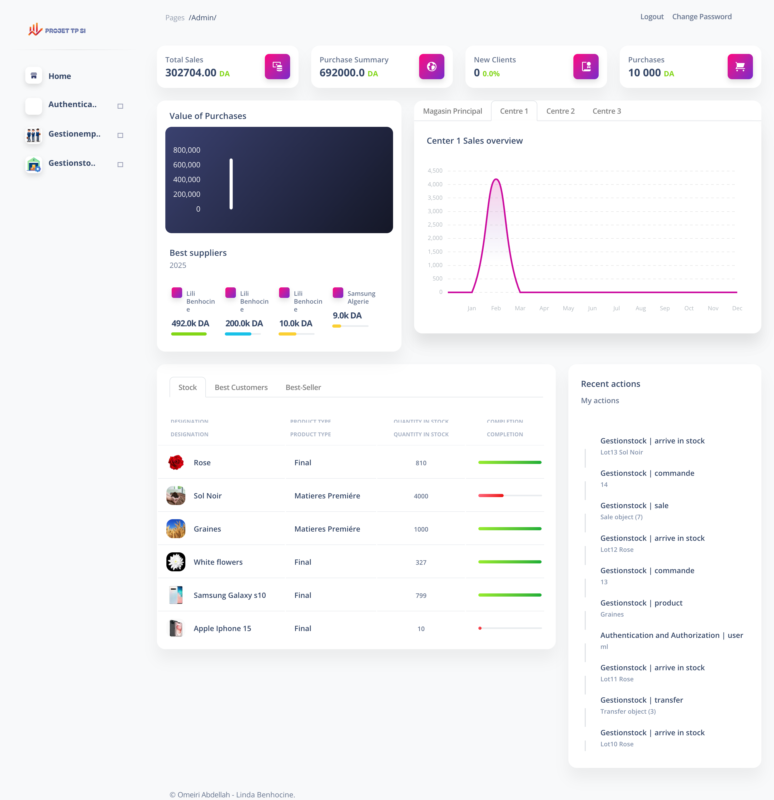

<div align="center">
  
  
  # MonStock
  
  [](https://www.djangoproject.com/)
  [](LICENSE)
  [](http://makeapullrequest.com)

  An advanced agricultural inventory management system built with Django
</div>

## 📱 App Showcase
<div align="center">
  <table>
    <tr>
      <td align="center">
        
        <br />
        <b>Secure Authentication</b>
        <br />
        Modern login interface with email verification
      </td>
      <td align="center">
        
        <br />
        <b>User Registration</b>
        <br />
        Streamlined registration process with email confirmation
      </td>
    </tr>
    <tr>
      <td align="center">
        
        <br />
        <b>Main Dashboard</b>
        <br />
        Comprehensive overview of inventory, sales, and analytics
      </td>
      <td align="center">
        
        <br />
        <b>Inventory Management</b>
        <br />
        Real-time stock tracking and transfer management
      </td>
    </tr>
  </table>
</div>

## 🌟 Features

- **Comprehensive Stock Management**
  - Track products, raw materials, and finished goods
  - Real-time inventory updates
  - Transfer management between centers
  
- **Sales & Purchase Management**
  - Customer and supplier management
  - Invoice generation
  - Credit tracking system
  
- **Production Center Management**
  - Three distinct production centers
  - Employee attendance tracking
  - Salary calculation system
  
- **Advanced Analytics**
  - Sales performance tracking
  - Purchase analysis
  - Profit margin calculations
  - Visual dashboards and reports

## 🚀 Getting Started

### Prerequisites

- Python 3.8+
- pip
- virtualenv

### Installation

1. Clone the repository
```bash

git clone https://github.com/Mromeiri/Mon-Stock
cd monstock
```

2. Create and activate virtual environment
```bash
python -m venv venv
source venv/bin/activate  # On Windows use: venv\Scripts\activate
```

3. Install dependencies
```bash
pip install -r requirements.txt
```

4. Set up environment variables
```bash
cp .env.example .env
# Edit .env with your configuration
```

5. Run migrations
```bash
python manage.py migrate
```

6. Create superuser
```bash
python manage.py createsuperuser
```

7. Run the development server
```bash
python manage.py runserver
```

Visit `http://localhost:8000` to access the application.


## 🔧 Technology Stack

- **Backend:** Django 4.2
- **Frontend:** HTML5, CSS3, JavaScript
- **Database:** PostgreSQL
- **Authentication:** Django Authentication System
- **Charts:** Chart.js
- **UI Framework:** Bootstrap 5

## 📝 License

This project is licensed under the MIT License - see the [LICENSE](LICENSE) file for details.

## 🤝 Contributing

Contributions, issues, and feature requests are welcome! See [CONTRIBUTING.md](CONTRIBUTING.md) for ways to get started.

## 👥 Authors

- ([@Mromeiri](https://github.com/Mromeiri))

## 🙏 Acknowledgments

- Special thanks to R.BOUDOUR for the project requirements and guidance
- Django community for excellent documentation
- All contributors who help improve this project

---

<div align="center">
  Made with Omeiri Abdellah & Linda Benhocine
</div>
